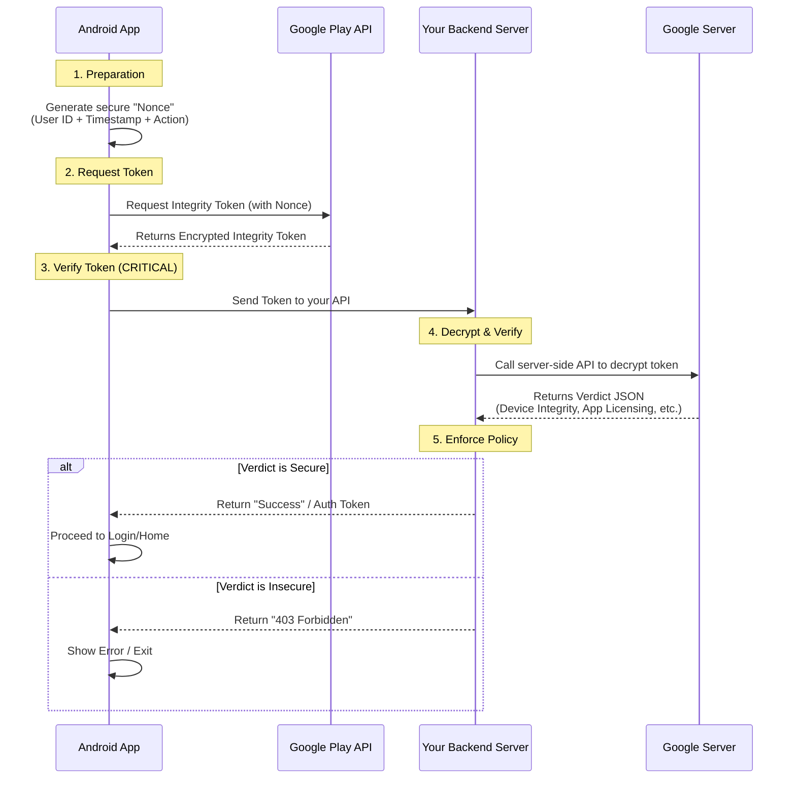

# Google Play Integrity API: Workflow & Implementation Guide

This document explains how the Play Integrity API works securely involving the Client (App), Google, and your Backend Server. It also analyzes the current implementation gap in the `ClickLife` app.

## The Secure Workflow (Standard)

The Play Integrity API is designed to be a "attestation" service. It involves three parties:
1.  **Your App** (Client)
2.  **Google Play Servers** (Provider)
3.  **Your Backend Server** (Verifier)

### Sequence Diagram



## Step-by-Step Explanation

### 1. Generate Nonce (Client)
The app generates a unique string called a **nonce**.
*   **Purpose**: Prevents "Replay Attacks" (where a hacker captures a valid token from a good device and reuses it on a bad device safely).
*   **Best Practice**: Hash of `Guid/UserID` + `Timestamp`.

### 2. Request Token (Client)
The app calls the Play Integrity API.
*   **Code**: `integrityTokenProvider.request(...)`
*   **Result**: Google checks the device (Is it rooted? Is it an emulator? Is the app unmodified?) and returns an **Encrypted Token**.
*   **Important**: The app *cannot* read this token. It is a sealed envelope.

### 3. Send to Server (Client -> Server)
The app sends this token string to your backend server (e.g., via a Login API or a dedicated `/verify-integrity` endpoint).

### 4. Verify Verdict (Server -> Google)
Your backend server calls Google's server-side API:
`POST https://playintegrity.googleapis.com/v1/packageName:decodeIntegrityToken`
*   **Input**: The encrypted token.
*   **Output**: A JSON object containing the verdict.

**Example Verdict JSON:**
```json
{
  "deviceIntegrity": {
    "deviceRecognitionVerdict": [
      "MEETS_DEVICE_INTEGRITY"  // Good (Real Android Device)
    ]
  },
  "appIntegrity": {
    "appRecognitionVerdict": "PLAY_RECOGNIZED", // Good (Downloaded from Play Store)
    "packageName": "com.developer.goyo",
    "versionCode": "596"
  },
  "accountDetails": {
    "appLicensingVerdict": "LICENSED" // Good (User owns the app)
  }
}
```

### 5. Enforce Action (Server)
Your server decides logic based on the verdict:
*   If `MEETS_DEVICE_INTEGRITY` is missing -> **Block User**.
*   If `packageName` does not match -> **Block User**.
*   Otherwise -> **Allow Access**.

---
