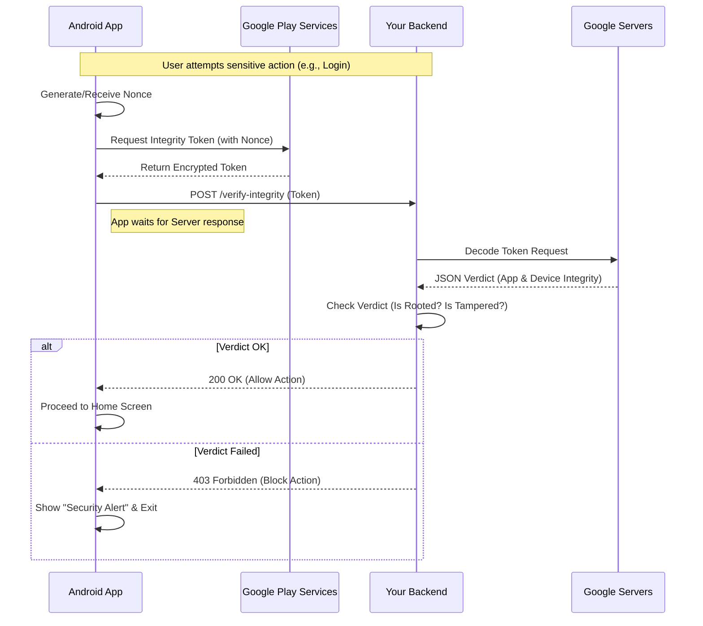

# Google Play Integrity API: Client-Side vs. Server-Side Implementation Guide

The Google Play Integrity API protects your apps and games from potentially risky and fraudulent interactions, such as tampering and unauthorized access, so you can respond with appropriate actions to prevent attacks and reduce abuse.

This guide explains the workflow for integrating the API, highlighting the distinct roles of the **Client (Android App)** and the **Server (Backend)**.

## 1. High-Level Workflow

The integrity check is a **three-step process**:
1.  **Client (App):** Generates a request and obtains an encrypted Integrity Token from Google Play.
2.  **Server (Backend):** Receives the token from the app and decrypts/verifies it with Google's servers.
3.  **Action:** The server decides whether to trust the device based on the verdict (e.g., allow login, block access).

## 2. Client-Side Implementation (Android App)

The Android app's responsibility is **limited** to requesting the token. It should **never** attempt to make security decisions based on the token itself, as the token is encrypted.

### Steps:
1.  **Prepare the Integrity Token Provider:** Initialize the API early in the app lifecycle (e.g., `onCreate`).
2.  **Generate a Nonce:** Create a unique, random string (nonce) to prevent replay attacks. This should ideally be provided by your server or generated securely (e.g., hash of `session_id` + `timestamp`).
3.  **Request the Token:** Call the Integrity API with the nonce.
4.  **Send to Backend:** Once the token is received (on success), send it immediately to your secure backend server via an API call (e.g., `/api/verify-integrity`).

```java
// Simplified Client-Side Logic
IntegrityManager.getInstance(context).requestIntegrityToken(nonce, new IntegrityCallback() {
    @Override
    public void onSuccess(String token) {
        // CRITICAL: Do NOT verify here. Send 'token' to your backend.
        apiClient.verifyToken(token);
    }
});
```

## 3. Server-Side Implementation (Your Backend)

The backend is the **brain** of the operation. It holds the decryption keys and makes the final decision.

### Steps:
1.  **Receive Token:** Endpoint receives the encrypted token string from the app.
2.  **Decrypt & Verify:**
    *   **Option A (Google Play Server):** Call Google's REST API (`https://playintegrity.googleapis.com/v1/...:decodeIntegrityToken`) to decode the token. This is the standard and recommended approach.
    *   **Option B (Local Decryption):** Decrypt locally using the private keys (rare, only for high-throughput needs).
3.  **Analyze Verdict:** Google returns a JSON response containing the integrity verdict. content includes:
    *   `appIntegrity`: Matches your package name and signature?
    *   `deviceIntegrity`: Does the device meet security standards (`MEETS_BASIC_INTEGRITY`, `MEETS_DEVICE_INTEGRITY`, `MEETS_STRONG_INTEGRITY`)?
    *   `accountDetails`: Is the user licensed?
4.  **Enforce Policy:**
    *   **Pass:** If verdicts are good, allow the requested action (e.g., "Login Successful").
    *   **Fail:** If checks fail (e.g., device is rooted), deny the action and return an error to the app (e.g., "Security Authorization Failed").

## 4. Why Verification MUST Be Server-Side

You might ask: *"Why can't I just check the token inside the app?"*

1.  **Encryption:** The token returned by Google is an encrypted JWE (JSON Web Encryption). To decrypt it, you need encryption keys. If you put these keys inside your app code, **attackers can extract them** and forge fake "Success" tokens.
2.  **Tampering:** If the verification logic is in the app, an attacker can modify the app (recompile it) to always say "Verified: True" regardless of the actual result.
3.  **Trust:** The server is a trusted environment you control. The client device is in the user's hands and is inherently untrusted.

## 5. Sequence Diagram



## 6. Summary for Your Project

Currently, your implementation stops at **Step 2 (Client-Side)**.
*   **What you have:** The app gets the token.
*   **What is missing:** The app does not send it to a backend. It just logs it and continues.
*   **Result:** The security check is effectively "silent." It generates a report but nobody reads it to stop the intruder.

To make it functional, you would need to implement the Server-Side logic described above. until then, the **Client-Side Native checks** we added are your best line of defense.
